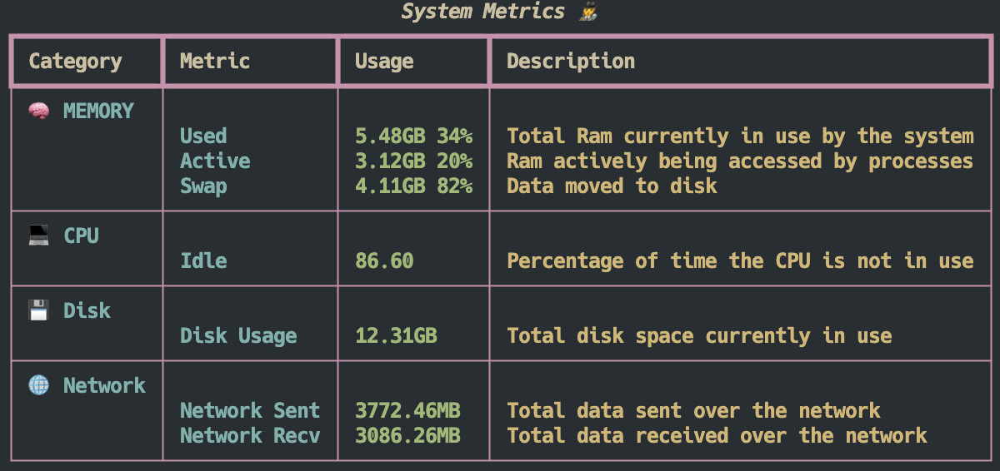
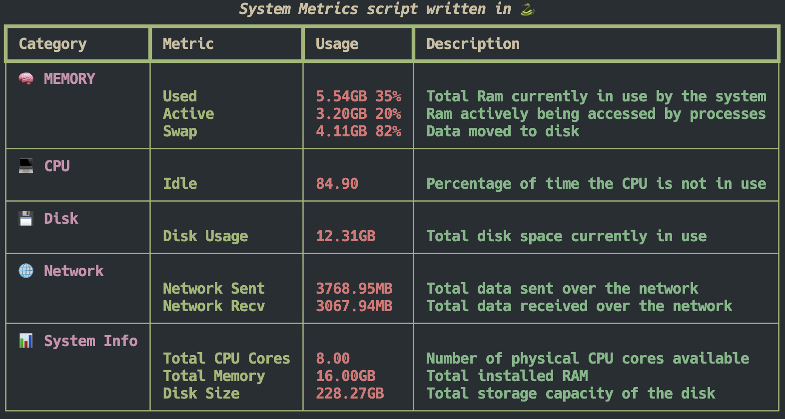

# DynamicSystemMetrics

A flexible script that renders a system metrics table using `psutil`. Function calls are dynamically defined and executed at runtime via a YAML configuration, allowing high customization and adaptability.

## Why?

Since I wanted to play around with Python and learn a new programming language, I built this small project focused on OS-level metrics. The idea was to showcase how injecting values via a config file can make code more flexible and adaptable.

Since `psutil` metric-gathering functions are generated at runtime, we can dynamically add new ones to be rendered in the table. Of course, this comes with a trade-off: higher complexity and trickier debugging. In a real production setup, you'd typically send these metrics to a collector like Prometheus instead—but hey, this is just for fun and learning!

## Example

Here’s an example of the generated table using `config.yaml`:

And another example using `config_system_info.yaml`, which also includes static system metrics:

Based on the provided config file, we can define the actual values shown, the table’s style, and which metrics should be visualized! :rocket:

## Possible Enhancements

While this project serves as a flexible proof of concept, here are some potential improvements that could be explored:

1. **More complex calculations**: Extending the system to support computed metrics like data received over the network per second. This could be implemented via a dynamic calculator that determines and executes operations defined in the YAML file.

2. **Structured logging**: In a production setup, structured logging (e.g., JSON format) would improve filtering, flexibility, and traceability in distributed environments.

3. **Custom exception handling**: Introducing a `MetricError` exception could improve error management for unsupported or failing metric functions.

4. **Unit tests**:  Adding unit tests would ensure correctness and prevent regressions, making future enhancements safer.
